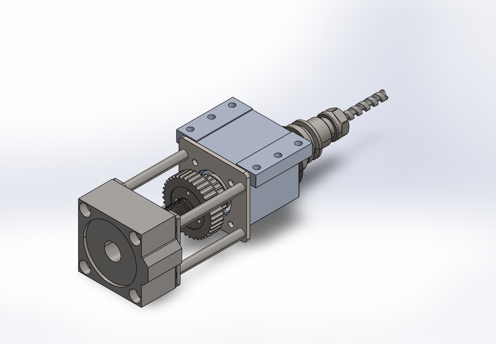
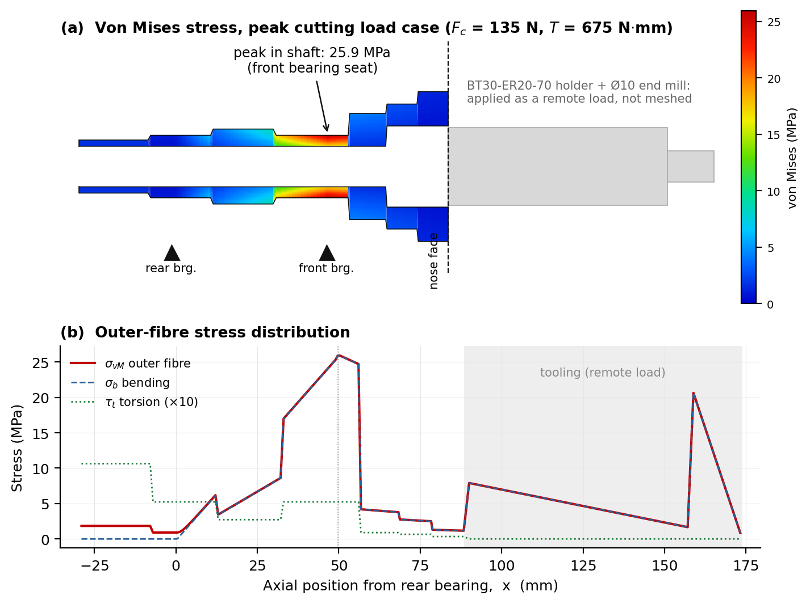
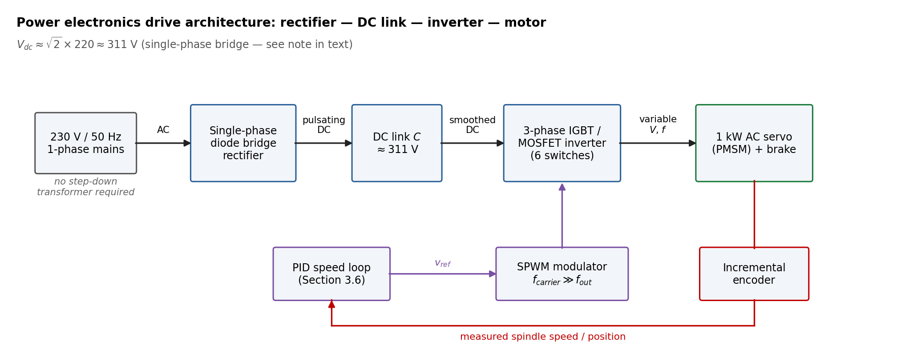
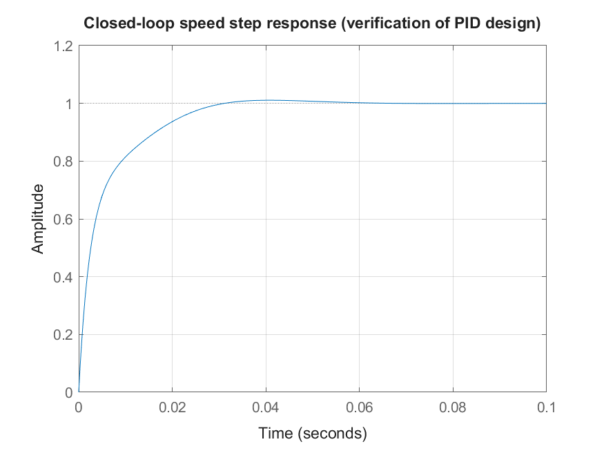
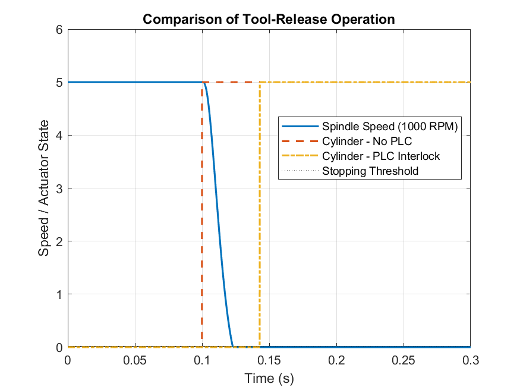

# Design, Analysis and Modeling of CNC Spindle System

Internship project by Group 6, Department of Electromechanical Engineering, AASTU. Host: Ethio-Engineering Group, July–September 2026.

Full report: `Design, Analysis and Modeling of CNC Spindle System.pdf` (source: `.tex`).

## What this project is

Design and system-level model of a BT30 pneumatic tool-change CNC milling spindle rated to 5000 RPM, treated as one integrated mechatronic system: mechanics + motor/drive + PID speed control + PLC supervisory interlock.

Design basis: aluminum 6061-T6 roughing cut with 10 mm 3-flute end mill. Peak cutting force 135 N, peak torque 0.675 N·m, average cutting power ~169 W.

## How it was done

**1. Mechanical design (SolidWorks + hand calcs).**
Shaft, 6004 deep-groove bearings, 7075-T6 housing, BT30-ER20-70 interface, Belleville stack, M12 drawbar, 50:30 5M belt drive, floating puller assembly. Overhung-load model: front bearing 471 N, rear bearing 336 N reversed, max bending moment 16.72 N·m at front bearing.

**2. Structural validation (analytical + beam FEA).**
Hollow shaft (20 mm OD / 13 mm ID, 20CrMnTi): von Mises 25.9 MPa, FoS ~28.3. Hand calc and beam FEA agree to 0.1%. Housing shoulder FoS 12–17, puller plate FoS 2.5–3.5. Key finding: shaft is stiffness/bearing-fit governed, not strength governed. Drawbar release load (2940–4021 N) routes through puller plate into housing, bearings stay isolated.

**3. Electrical drive (AC servo + VFD model).**
1000 W AC servo with brake (220 V variant for 230 V/50 Hz mains), 3000 RPM rated, matches 5000 RPM spindle through exact 5:3 belt ratio. Drive modeled as rectifier – DC link (~310 V) – IGBT inverter with SPWM switching.

**4. Control (state-space + PID pole placement, MATLAB).**
Plant: `J dw/dt = Kt·I − B·w − TL`, `L dI/dt = V − R·I − Ke·w`. PID on encoder feedback. Results: 16 ms rise, 26 ms settle, 1.08% overshoot, infinite gain margin, 109 deg phase margin. Peak-torque dip −3.35 rad/s (~0.64%), recovered in ~70–80 ms.

**5. Supervisory PLC interlock (Stateflow logic).**
`Cylinder_Actuate = Tool_Request AND (RPM <= 5)`. Without interlock cylinder fires at 5000 RPM. With interlock spindle decelerates first, cylinder fires only at standstill.

## Repository layout

- `Design, Analysis and Modeling of CNC Spindle System.tex/.pdf` — full report
- `Pictures/` — CAD renders, FEA plots, MATLAB figures used above
- `Matlab Scripts/` — PID design script, PLC interlock simulation, Simulink `.slx` drive model
- `3d Models/` — SolidWorks assembly and parts (`.SLDASM/.SLDPRT`)
- `ASSEMBLY_Milling_Spindle_BT30_Drawing.pdf`, `Blockdiagram_simulink.pdf` — drawings and block diagram

To reproduce: open MATLAB scripts in `Matlab Scripts/`, run PID script to regenerate Bode/root-locus/step figures; run PLC script to regenerate interlock timelines; open `.slx` for drive simulation.

## Improvements needed

From Chapter 5 recommendations:

- Replace 6004 deep-groove bearings with angular-contact bearings for thrust capacity; may simplify floating-plate mechanism.
- Extend FEA to transient dynamics with real bearing stiffness: natural frequencies and critical speeds vs 5000 RPM range.
- Add rectifier/inverter loss model to SPWM Simulink model to quantify drive efficiency.
- Extend PLC simulation to full ATC sequence: clamp/unclamp sensors plus ATC arm motion.
- Longer term: IoT remote monitoring, fuzzy/PID hybrid control.
